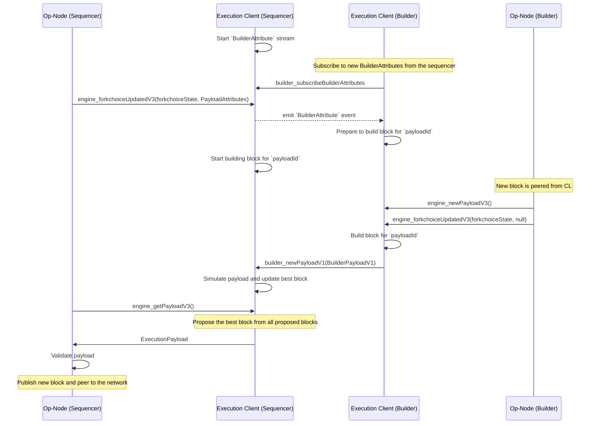

# World Chain Builder

## Block Builder API Interation

```mermaid
sequenceDiagram
    participant CLS as Op-Node (Sequencer)
    participant ELS as Execution Client (Sequencer)
    participant ELB as Execution Client (Builder)
    participant CLB as Op-Node (Builder)

    ELS->>ELS: Start `BuilderAttribute` stream

    Note over ELB: Subscribe to new BuilderAttributes from the sequencer
    ELB->>ELS: builder_subscribeBuilderAttributes

    CLS->>ELS: engine_forkchoiceUpdatedV3(forkchoiceState, PayloadAttributes)
    ELS-->>ELB: emit `BuilderAttribute` event
    ELB->>ELB: Prepare to build block for `payloadId`
    ELS->>ELS: Start building block for `payloadId`

    Note over CLB: New block is peered from CL
    CLB->>ELB: engine_newPayloadV3()
    CLB->>ELB: engine_forkchoiceUpdatedV3(forkchoiceState, null)

    ELB->>ELB: Build block for `payloadId`
    ELB->>ELS: builder_newPayloadV1(BuilderPayloadV1)
    ELS->>ELS: Simulate payload and update best block

    CLS->>ELS: engine_getPayloadV3()
    Note over ELS: Propose the best block from all proposed blocks
    ELS->>CLS: ExecutionPayload

    CLS->>CLS: Validate payload
    Note over CLS: Publish new block and peer to the network
```

