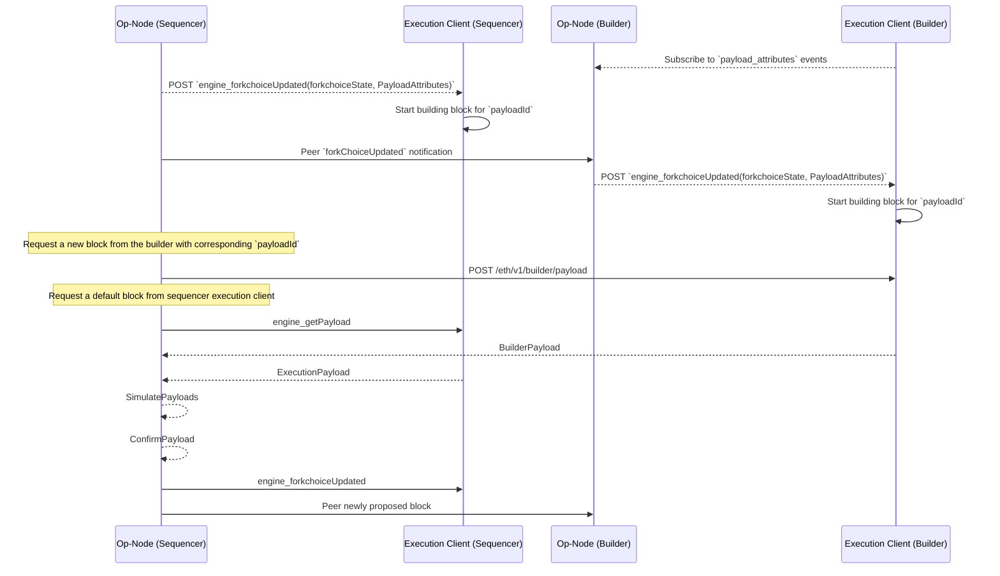

# World Chain Builder

This is an implementation of a block builder for proposer / builder separation (PBS) in the optimism stack. Please see [this guide](https://github.com/flashbots/optimism/blob/daa43f158ffca0bfaba18391f688fed1d8a8f3d9/pbs/README.md) on how to run and test with a local devnet.

## Block Builder API Interation

The builder requires an [op-node](https://github.com/flashbots/optimism/tree/pbs) that publishes an event stream with the block payload attributes to trigger block building. 

To request a block, the proposer does a http request to the builder in parallel with its local node for a block as a failsafe. The following sequence diagram describes the interactions between the builder and the proposer.

The proposer and builder uses ECDSA secp256k1 signatures to authenticate the proposer and verify the authenticity of the payload from the builder.
