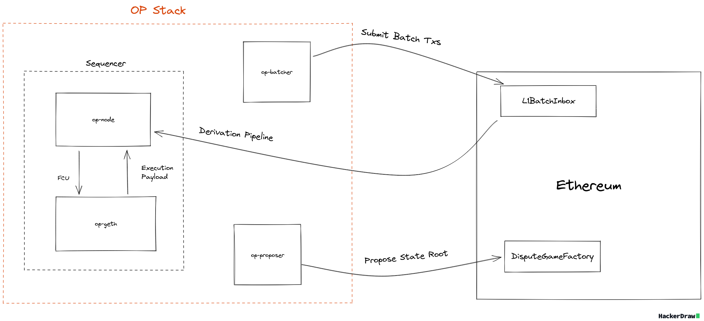
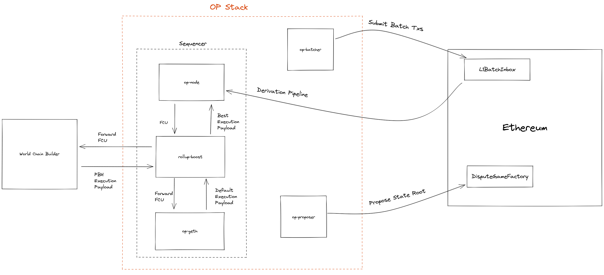

# PBH Architecture 

World Chain is an OP Stack chain, enabling priority blockspace for humans through the World Chain Builder. In order to fully understand the builder, lets quickly review how transaction inclusion works within the OP Stack. The diagram below demonstrates an abridged version of the lifecycle of a transaction on Optimistic Rollups.

## Block Production on the OP Stack

When a user sends a transaction to a node, the pending transaction is forwarded to the sequencer and added to the sequencer’s mempool. The sequencer is like any other node in the network, with the only exception being that it can propose new blocks and advance the chain. Every node in the OP Stack has an execution client (EL) and a consensus client (CL).

The [Engine API](https://specs.optimism.io/protocol/exec-engine.html#engine-api) defines the communication protocol between the CL and the EL and is responsible for orchestrating block production as well as advancing the unsafe/safe head of the chain. Periodically, the CL will send a request to the EL signaling for a new block to be built. After a series of API calls between the CL and EL, the EL will return a new `ExecutionPayload` containing a newly constructed block. The CL will then advance the unsafe head of the chain and peer the new block to other nodes in the network.

Transaction ordering occurs in the payload builder which is responsible for building a new block in response to a fork choice update (FCU) message from the `op-node`. Note that transaction ordering within the payload builder is not enforced at the protocol level. A block builder can construct a valid block with any combination of pending transactions, in any order. Eventually though, it may be possible to enforce ordering at a protocol level through the derivation pipeline. Currently, there is an experimental spec [outlining a transaction ordering policy](https://github.com/ethereum-optimism/specs/blob/feat/tx-ordering-policy/specs/experimental/tx-ordering-policy.md#transaction-ordering-policy-1) for OP Stack chains.

## Block Production on World Chain
To enable PBH for verified users on World Chain, an external block builder has been developed that prioritizes transactions with a valid World ID proof (For more information on what PBH transactions are, check out the [Lifecycle of a PBH Transaction docs](./pbh_tx_lifecycle.md)). World Chain uses [rollup-boost](https://github.com/flashbots/rollup-boost), a OP stack "sidecar" service that orchestrates block production between external block builders and the OP stack sequencer.

In this design, whenever the sequencer needs a new block to be built, `op-node` will send a Fork Choice Update (FCU) notification to the sidecar, which will multiplex the FCU to the sequencer's execution client as well as the World Chain builder. Shortly after, `op-node` will send a `getPayload` request to the sidecar, which will forward the request to the builder as well as the sequencer's execution client. Each of the payload builders will send a built block back to the sidecar, which will forward the best block to the sequencer's `op-node`. The newly built block will then be published and propagated throughout the network. 

Using `rollup-boost` allows for custom transaction sequencing rules without modifying either of the core Optimism Protocol clients (`op-node` and `op-geth`). Additionally, this design ensures that block production is never halted due to failures in the builder. Since the sequencer's default execution client also produces a block, `rollup-boost` will always have a block to propose to `op-node`.

For more information on PBS within the OP stack, check out the [design docs for external block production](https://github.com/ethereum-optimism/design-docs/blob/main/protocol/external-block-production.md) as well as the [rollup-boost repo from Flashbots](https://github.com/flashbots/rollup-boost).

